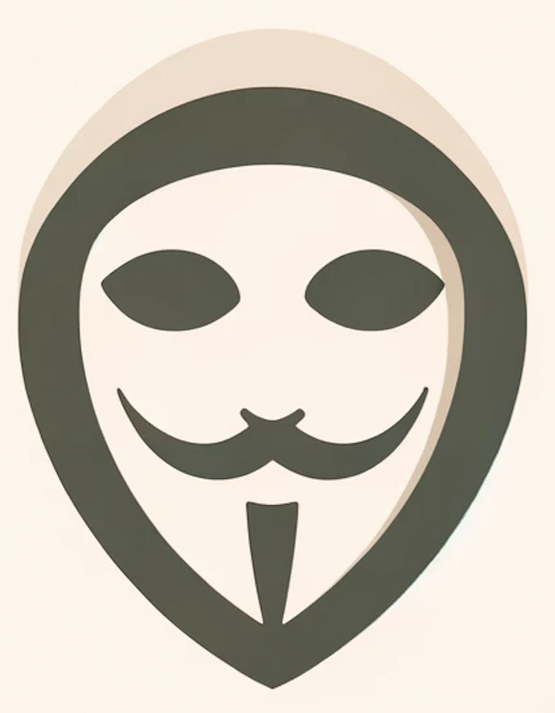

This is the repo containing the front end for Munus. The repo containing the Munus smart contracts can be found here: https://github.com/hackaugusto/munus

Contracts are deployed on Base at: https://basescan.org/address/0x744fDb6CC91C3E86Be09A4d49cA77386A21f3dAc

# MUNUS: _Anonymous Donations_, by JAUF

Munus allows anonymous donations to charities. It utilizes [Firn](https://firn.cash) to decouple the address of the donator from the transaction to the charity. The donator can at any point in time reveal the secret used to hash the transaction data to prove that they did indeed perform the donation. This can be useful for tax returns or other situations where it might be necessary to prove that a donation was made.

### How it works

- Prerequisite: User has funds on Firn (currently only Base supported)
- User connects to Munu's website with Metamask using the Firn MetaMask Snap
The user selects the address of the charity and donation amount and hashes it with a secret
- Firn Snap creates proof for transaction and calls the Munus smart contract
- Munu's smart contract registers the hash of the tx and forwards the funds to the charity
- The user can at any point in time show that he did the transaction by revealing the secret (currently a "one of" event)

### Future improvement

- Charity registration / KYC to ensure charities receive money
- zk proof of donation without revealing the secret
- Automatic donation receipt generator
- Arbitrary wallet support (dependent on wallets supporting MM Snaps)

